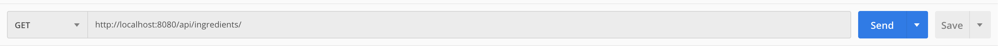
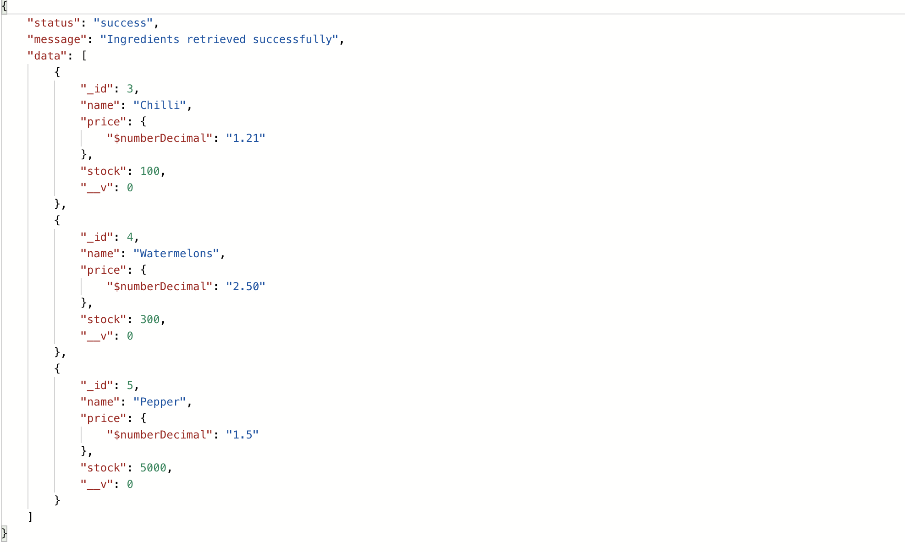
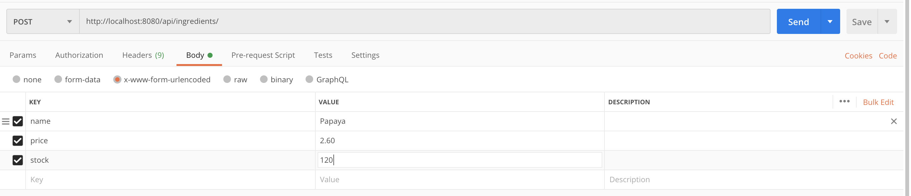
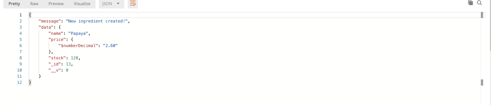
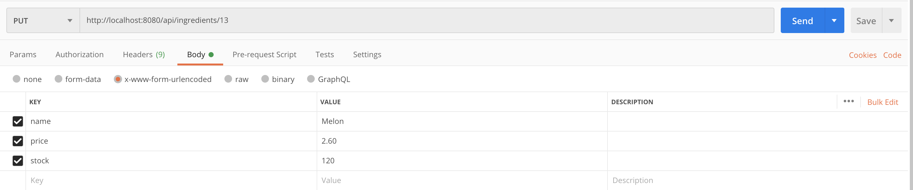
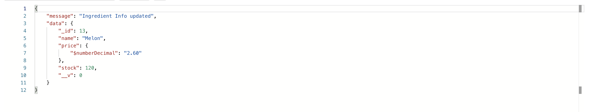
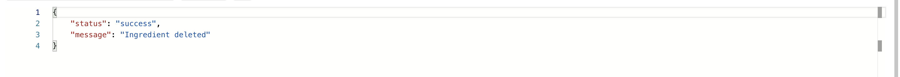
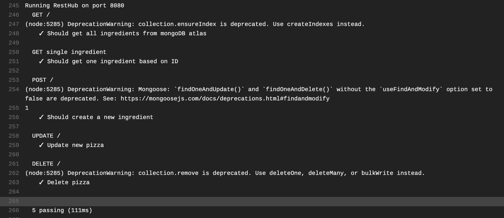
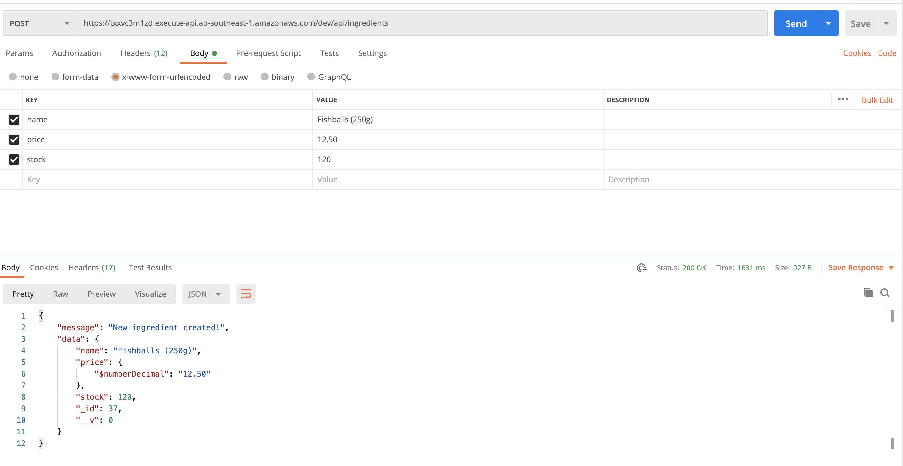
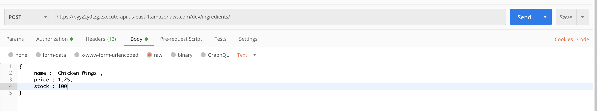

# CS3219 Assignment B

# Content Page

1. Assignment B1 - `RESTFUL API`

    1. [Dependencies](#Dependencies)

    2. [Setting Up Locally](#Setting-up-Locally)

    3. [Access Endpoint](#To-access-the-API-on-an-endpoint-(Heroku))

    4. [Data Structure](#Data-structure-for-database)

    5. [Examples](#Sample-API-Calls)

2. Assignment B2 - `Testing with Automated Integration`

    1. [Testing Locally](#Testing-locally)

    2. [Testing on Travis](#Testing-via-travis-CI)

3. Assignment B3 - `Endpoint with AWS Lambda (microservices)`

    1. [AWS Lambda with `Serverless-http`](#Deployed-endpoints-using-serverless-http)

    2. [AWS Lambda with self-defined Lambda functions](#Deployed-endpoints-using-self-defined-Lambda-functions)

4. [Assignment B4 - `Front-end for API`](#Assignment-B4)

## Assignment B1

### Description

A simple RESTFUL API to update and keep track of ingredients and food items and how much it costs. Not really useful, but a simple demo for RESTFUL API with node.js, express and mongoDB. Used MongoDB Atlas to host online DB. 

### Dependencies

Please install these on your own!

1. [npm](https://www.npmjs.com/get-npm)

2. [node](https://nodejs.org/en/download/)

3. [MongoDB](https://docs.mongodb.com/manual/installation/)

### Setting up Locally

1. Git clone the repository. Then at root folder, type `npm install` to install all the dependencies.

2. To start up the local mongodb, type in `npm run start_db` at root of the project.

3. To start up the server, type in `npm run dev` at root of the project.

4. Then to access, go to `localhost:8080`

5. To access the RESTFUL api for the server, go to `localhost:8080/api/ingredients`. If you omit `/ingredients`, you will see a webpage with a happy message :).

6. Go Postman and try out the requests! See below for examples!

### To access the API on an endpoint (Heroku)

#### Technology Stack

1. `Node.js`

2. `MongoDB`: hosted via mongoDB atlas

3. `Express`

4. `Mongoose`

#### How to use the deployed API endpoint on Heroku

1. Just type in this link -> `https://contact-heroku.herokuapp.com/api/ingredients`.

    1.1 `https://contact-heroku.herokuapp.com/api/ingredient/id` indicates the specific ingredient with that ID! Only GET, PUT and DELETE requests are allowed.

    1.2 `https://contact-heroku.herokuapp.com/api/ingredients` is for all ingredients in database. GET AND POST methods are only allowed. 

2. The routes are the same, `https://contact-heroku.herokuapp.com/api` will direct you to a webpage with a happy message :).
 
### Data structure for database

Each ingredient contains 3 fields, all which are required. What the fields represent are self-explanatory. They are:

1. Name: `String`

2. Price: `Float`

3. Stock: `Int`

4. _id: `Int`, this is auto-generated by Mongo Sequence Auto-increment. Can be ignored, here for your reference. `_id` is unique.

### Sample API Calls

#### Get

##### GET Request

##### GET Result

#### Post

##### POST Request

##### POST Result

#### PUT/UPDATE

Required to update all fields!.

##### PUT Request

##### PUT Result

#### DELETE REQUEST

##### DELETE Request

##### DELETE RESULT

## Assignment B2

### Testing locally

1. Tests all `PUT`, `DELETE`, `POST`, and `GET` requests.

2. To run locally, simply type in `npm run test`

3. Ensure the mongodb is running -> `npm run start_db`

### Testing via travis CI

1. The files already contain the travis configurations.

2. Simply fork the repo and then add it to your travis account.

3. Trigger a build and see the same few tests running but on travis. Subsequently, any merges or updates to your forked repo will automatically trigger a build!

[Travis Build Link](https://travis-ci.org/github/kester-ng/Assignment-2)

Unit Tests for POST, DELETE, PUT, GET

## Assignment B3

### Endpoint for AWS Lambda function

#### Deployed endpoints using `serverless-http`

Deployed it onto AWS Lambda using `serverless-http`. Region is Singapore. 

1. GET - https://txxvc3m1zd.execute-api.ap-southeast-1.amazonaws.com/dev/api/ingredients

2. GET - https://txxvc3m1zd.execute-api.ap-southeast-1.amazonaws.com/dev/api/ingredients/{id}

3. POST - https://txxvc3m1zd.execute-api.ap-southeast-1.amazonaws.com/dev/api/ingredients

4. DELETE - https://txxvc3m1zd.execute-api.ap-southeast-1.amazonaws.com/dev/api/ingredients/{id}

5. UPDATE - https://txxvc3m1zd.execute-api.ap-southeast-1.amazonaws.com/dev/api/ingredients/{id}

#### Deployed endpoints using self-defined Lambda functions

Do take note. Currently, in postman, you can only POST/UPDATE with a body that is raw (ie x-www-form-urlencoded not supported). Do see picture below for an example. Also,the functions are located in US region LOL.

1. GET - https://pyyz2y0tzg.execute-api.us-east-1.amazonaws.com/dev/ingredients

2. GET - https://pyyz2y0tzg.execute-api.us-east-1.amazonaws.com/dev/ingredients/{id}

3. POST - https://pyyz2y0tzg.execute-api.us-east-1.amazonaws.com/dev/ingredients

4. DELETE - https://pyyz2y0tzg.execute-api.us-east-1.amazonaws.com/dev/ingredients/{id}

5. UPDATE - https://pyyz2y0tzg.execute-api.us-east-1.amazonaws.com/dev/ingredients/{id}

Also, travis will auto deploy the lambda functions onto AWS. However, if you would like to try to deploy it. It is important to configure a IAM user, and add in your own AWS access key and private key. And also change the process.env db link to your own db link. And any changes to the code will be deployed to AWS as well!

## Assignment B4

Refer to the link below for the repository and instructions for Assignment B4

[Assignment-B4](https://github.com/kester-ng/Assignment-2D)
